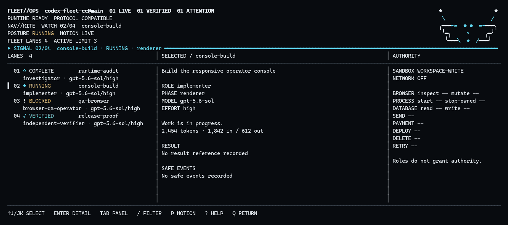

# Codex Fleet for Claude Code

Claude Code is good at holding the whole job in its head. Codex is useful when part of that job
can be handed to an independent worker. Codex Fleet connects those two ideas without turning your
terminal into a pile of tabs.

Claude Code remains the orchestrator. It decides whether a task should stay local or become one
or more bounded Codex lanes. A lane can investigate, research, implement, operate a browser, or
verify another lane's result. Fleet Console gives you one keyboard-first view of those lanes:
what is running, which model and effort were selected, what authority each lane has, what evidence
it produced, and whether its result was independently verified.

Press `Ctrl+G` to temporarily hand the same terminal to Fleet Console. Press `q` or `Esc` to return
to the same Claude Code session, with the draft prompt left intact. Opening or viewing the console
does not create a Claude or Codex model turn.

> **Development preview:** the runtime, console and Windows PTY handoff are implemented and covered
> by the local release gate. The project is not yet published as a Claude Code marketplace plugin.
> Cross-platform CI, deterministic packaging and the disposable-profile live Claude smoke remain
> release gates.

## Why this exists

Existing integrations can ask Codex to do a task, but a fleet creates harder questions:

- Which worker is allowed to write, browse, deploy, send, pay, or delete?
- Did a worker actually finish, or did it only say that it finished?
- Can several workers share one checkout without racing each other?
- What happens if a network call times out after an external mutation?
- Can I inspect the work without spending another model turn?
- Can I leave the dashboard and get back to the exact Claude session I was using?

Fleet treats those as product behavior, not prompt conventions. Roles do not grant authority.
`complete` is a worker claim; `verified` requires fresh evidence. Unknown external outcomes are not
blindly retried. One shared-checkout writer is allowed by default, and every wider capability is
explicit.

## How it fits together

```text
Claude Code
  ├─ orchestration skill     decides lane shape, authority and evidence contract
  ├─ /fleet:* commands       setup, doctor, status, result, export and uninstall
  └─ Ctrl+G handoff ──────────────────────────────────────┐
                                                         │ same terminal
Fleet Console                                            │
  ├─ lanes, evidence, authority and runtime health       │
  ├─ keyboard-first controls                             │
  └─ q / Esc ────────────────────────────────────────────┘

Fleet Runtime
  ├─ one local Codex app-server broker
  ├─ bounded lane scheduler
  ├─ fail-closed capability gates
  └─ private, redacted, atomic local state
```

Claude Code's supported external-editor action provides the terminal handoff. Fleet does not patch
Claude, inject keystrokes, run a nested Claude process, or open a permanent dashboard service.
The console starts on demand and exits completely when you return.

## The operator view

The interface is intentionally closer to an operator terminal than an AI chat dashboard:
near-black surfaces, dense alignment, restrained cyan and amber, green reserved for verified work,
and no ambient decorative motion. Its one living signature is KITE: a small terminal-native fleet
formation driven by the selected lane's real status. Active work assembles and releases the
formation at a capped four frames per second; verified work locks it; blocked and failed work use
distinct static postures. Wide terminals show lanes, selected evidence, and authority together.
Compact and narrow layouts progressively collapse KITE into a small signal sigil without hiding
essential controls.



This recording comes from the real renderer with sanitized fixture lanes. The PTY E2E opens the
preserved editor, returns to the fake Claude host, compares the draft byte-for-byte and confirms
that no owned child remains. It is not a product mockup or a claim about a live external account.

Core navigation is designed around:

| Key | Action |
| --- | --- |
| `↑` / `↓`, `j` / `k` | Select a lane |
| `Enter` | Inspect the selected lane |
| `Tab` | Move between panels |
| `/` | Filter lanes |
| `?` | Open contextual help |
| `m` | Send a bounded follow-up |
| `x` | Request confirmed cancellation |
| `e` | Open the editor Fleet preserved during setup |
| `p` | Pause or resume KITE motion |
| `q` / `Esc` | Return to Claude Code |

Mouse input is an optional convenience. Every essential operation remains available from the
keyboard. Linear plain-text status, monochrome output, reduced motion and narrow layouts are
implemented for screen readers and constrained terminals.

## Authority is part of the contract

A lane declares its role and its authority separately. An `implementer` is not automatically
allowed to write; a `researcher` is not automatically allowed to use a logged-in browser. The
contract can independently permit or deny:

- filesystem reads and writes;
- live network research;
- browser and account access;
- local process execution;
- database mutation;
- external send, payment, deployment, deletion, and retry.

The default is read-only and fail-closed. Mutable browser profiles, production tenants, and shared
checkouts are single-operator resources unless the contract explicitly isolates them. Cancellation
targets only the exact Codex thread and turn owned by the lane.

## Privacy and resource behavior

Fleet is local-only and telemetry-free by default. It uses the Codex CLI authentication,
configuration, MCP servers, and usage entitlement already present on the machine; it does not ask
for another API key or host user data.

Prompts and model reasoning are not persisted. Raw model output, cookies, access tokens, secrets,
and personal data are not stored in fleet state. The persisted index is limited to sanitized lane
metadata, progress, authority, evidence references, runtime identifiers, and token usage only when
Codex reports it. State is written atomically to a private per-user application-data directory.

The dashboard has no idle background UI process. The runtime shares one Codex app-server broker,
defaults to at most three active lanes and one writer per checkout, bounds retained history, and
redraws only when its view changes or a capped refresh tick fires.

The latest local Windows gate measured a 6.1 ms startup p95, 0% sampled idle CPU, a 4 Hz maximum
refresh tick, 1.5 MiB retained heap growth for the 256-lane fixture, a 50,841-byte state snapshot
and zero owned PTY children after exit. These are development-machine measurements, not universal
benchmarks; CI records platform-specific evidence on every run.

## Current status

This table describes evidence available in the repository today, not the intended final support
matrix.

| Surface | Status |
| --- | --- |
| Windows live terminal handoff | **Proven** on Claude Code v2.1.233; clean-profile release smoke remains |
| Windows runtime and PTY fixture | Passing: exact draft preserved, terminal restored, zero owned child |
| macOS Intel and Apple Silicon | CI and PTY gates configured; a green run is required before release |
| Linux x64 and ARM64 | CI and PTY gates configured; a green run is required before release |
| Fleet Console | Renderer, controller, input, accessibility and fixture E2E implemented |
| Marketplace install | Not yet published |
| Reversible settings setup | Core merge/backup/ownership layer tested; public CLI wiring remains |
| Live cross-process follow-up/cancel | Not yet integrated |

No release will be called cross-platform until Windows, macOS, and Linux CI plus PTY handoff tests
pass. Capability discovery is also kept separate from a successful live capability smoke.

## Work with the source today

There is no thirty-second production install yet. For development and review:

```bash
git clone https://github.com/cglremrcn/codex-fleet-cc.git
cd codex-fleet-cc
npm ci
npm run verify
```

The project keeps Node.js 18.18 as its compatibility floor and tests the current Node 24 LTS line;
use an active LTS release for ordinary development. Fleet has no production npm dependencies.
`node-pty` is development-only and is excluded from the plugin package.
Do not point your main Claude profile at the development plugin yet; setup, rollback, packaging,
and the live Claude smoke must all pass before that workflow is documented as supported.

The plugin contract uses Claude Code's marketplace/plugin directory mechanism and these commands:

```text
/fleet:setup      preview and apply the reversible terminal handoff
/fleet:doctor     test local runtime and optional capabilities
/fleet:status     show a compact evidence-oriented status
/fleet:open       show the configured Fleet shortcut
/fleet:result     inspect a sanitized lane result
/fleet:cancel     request confirmed cancellation
/fleet:export     preview and create a redacted support bundle
/fleet:uninstall restore only settings owned by Fleet
```

Those commands are the public contract. Setup, uninstall and live supervisor controls are still
blocked in the development preview until their final CLI wiring and disposable-profile smoke pass.

## Safety decisions that should not be “simplified”

- A lane's role never implies authority.
- Read-only status must not modify the repository.
- A completed lane is not displayed as verified without an independent verifier.
- External effects with an unknown outcome block automatic retry until reconciled.
- User input never enters a shell command string.
- Setup structurally merges settings, shows an exact preview, and records ownership hashes.
- Uninstall refuses to overwrite editor settings that changed after Fleet setup.
- The console never edits Claude's draft file unless the preserved editor is explicitly opened.
- Support exports require a preview and omit prompts, secrets, cookies, and canonical private paths.

## Development principles

Production behavior is built with RED–GREEN–REFACTOR: a failing test first, the smallest behavior
that makes it pass, then refactoring under the green suite. Platform claims require verification in
the platform that matters. Mock-green does not mean PTY-green, and PTY-green does not mean a live
Claude profile is safe to modify.

The implementation plan and current release gates live in
[`docs/superpowers/plans/2026-08-17-codex-fleet-cc-implementation.md`](docs/superpowers/plans/2026-08-17-codex-fleet-cc-implementation.md).
The approved product and threat-boundary design lives in
[`docs/specs/2026-08-17-codex-fleet-cc-design.md`](docs/specs/2026-08-17-codex-fleet-cc-design.md).

## Project guides

- [Architecture](ARCHITECTURE.md)
- [Threat model](docs/THREAT_MODEL.md)
- [Security policy](SECURITY.md)
- [Troubleshooting](docs/TROUBLESHOOTING.md)
- [Contributing](CONTRIBUTING.md)
- [Code of Conduct](CODE_OF_CONDUCT.md)

## Upstream and license

The Codex runtime layer is derived from OpenAI's
[`openai/codex-plugin-cc`](https://github.com/openai/codex-plugin-cc), inspected from commit
`db52e28f4d9ded852ab3942cea316258ae4ef346`. Required upstream notices and the full license are
retained in [`NOTICE`](NOTICE), [`LICENSE`](LICENSE), and the installable plugin tree.

This project is licensed under Apache-2.0. It is an independent community project and is **not affiliated with or endorsed by OpenAI or Anthropic**. “OpenAI”, “Codex”, “Anthropic”, and “Claude”
remain trademarks of their respective owners.

## Contributing

Read [CONTRIBUTING.md](CONTRIBUTING.md) before a broad change. Bug and feature forms are available
in GitHub. Report vulnerabilities through the private path described in [SECURITY.md](SECURITY.md),
never in a public issue. Do not attach credentials, prompts, customer data or unsanitized support
output.
