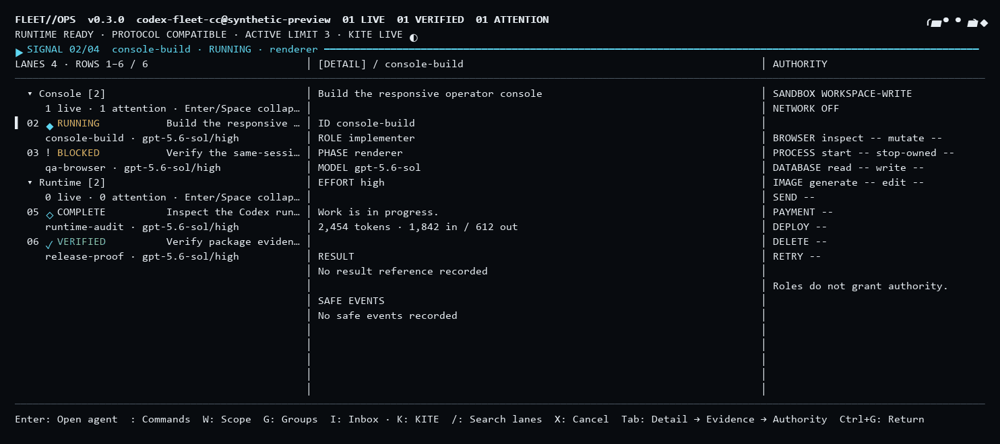

# Fleet 0.3.0: commit incelemesi ve bütünleştirme raporu

## Sonuç ve kapsam

GPT Pro güncellemeleri gerçek Git geçmişi üzerinde karşılaştırıldı. #9, #10, #11 ve
tamamlanan #12 sırasıyla main dalına birleştirildi. Bundle'ın bağımsız kök geçmişi
main'e taşınmadı. Bunların üzerine çalışma sınırları, tur kimliği, konsol ve inbox
temizliği düzeltildi; paket, marketplace, runtime ve görseller 0.3.0'a eşitlendi.

Windows / Node 22.20.0 üzerinde birleşik `npm run verify` çıkışı **0**:
483 test, 482 başarılı, 1 platform atlaması, 0 hata. Bu sonuç gerçek hesapta
model çalıştırıldığı veya kurulu Claude profilinin yükseltildiği anlamına gelmez.

## PR ve bundle karşılaştırması

| Kaynak | Doğrulanan içerik | Sonuç |
| --- | --- | --- |
| #9 — `e06c7645` | Gruplama, filtreler, runtime model listesi, kullanım sayaçları, writer kimliği | İncelendi ve birleştirildi |
| #10 — `c7d7384a` | Proje/native oturum envanteri, kayıtlı görünümler, özel yerel kayıtlar | İncelendi ve birleştirildi |
| #11 — `dc7a2781` | KITE ve tek uçuşlu oturum gözlemi | Bundle KITE ağacıyla birebir aynı |
| Bundle — `3c79c5c1` | KITE commit'i; bağımsız review kökü üzerinde | #11 zaten içerdiği için tekrar uygulanmadı |
| Bundle — `6f30e304` | Ortak müdahale kutusu | Gerçek #11 geçmişine uygulanarak doğrulandı |
| #12 — `cfdd28f8` | Inbox paketinin 30 dosyasından 29'u | Eksik renderer'ın üç kısayol satırı tamamlandı |
| #12 tamamlaması — `da1c787d` | Geniş, kompakt ve dar görünümde Inbox kısayolu | Tam bundle ağacıyla eşleşti; 53 renderer/KITE testi geçti |
| #2 ve #3 | CodeQL init/analyze commit pinleri | Aynı resmi CodeQL v3.37.7 commit'ine birlikte alındı |

Doğrulanan tam ağaç kimlikleri:

- #10 ve bundle review-base: `f0bc5dfb6b0b23628622db85ea856fc9cd6ca15f`
- #11 ve bundle KITE: `96559f1c2c85668a7eaeeff3839ea2e31c0fc6d6`
- Tamamlanan #12 ve bundle inbox: `f1680dc88587ea7f725a4d386ece7a7c16c50738`

`git bundle verify` başarılıdır. Kaynak eşitliği commit mesajına bakılarak değil,
Git ağaç kimlikleri ve dosya farklarıyla doğrulandı. Yeni güvenilirlik düzeltmeleri
bu eşleşen kaynak tabanından sonra gelir; son 0.3.0 ağacının bundle ile aynı olması beklenmez.

## Düzeltilen bulgular

| Öncelik | Somut sorun ve etkisi | Düzeltme / kanıt |
| --- | --- | --- |
| P1 | İki tamamlanmış writer eşzamanlı devam ettirilince ikisi de boş slot görüp aynı workspace'e yazabiliyordu. Read-only devamlar da maxActive sınırını denetlemiyordu. | `scheduler.mjs:535` ve `:731`: await öncesi rezervasyon; kesin ret sonrası bırakma; belirsiz sonuçta koruma; yeniden yüklemede rezervasyonun geri kurulması. `scheduler-admission-races.test.mjs` |
| P1 | İlk start isteğinde iş sayısı kapasiteyi aşınca bütün admissions bekleniyor, fakat kuyruğu ilerletecek monitor henüz başlamıyordu. | `fleet-supervisor.mjs:330`: monitor beklemeden önce kurulur. Başlatılmakta olan iş erken reconcile ile düşürülmez. Kapasite=1, iki iş regresyonu. |
| P1 | Eski turn/start yanıtı, notification ile başlamış otomatik devamın tur kimliğini ezebiliyordu. | `runtime-adapter.mjs:498`: dispatch kimliğiyle üç turn/start çağrı yolu korunur. `runtime-dispatch-races.test.mjs` |
| P2 | Native parent gruplaması `parent` okuyordu; envanter `parentThreadId` üretiyordu. Kardeşler Unreported altında birleşiyordu. | `lane-navigation.mjs:62`: ortak alan eşlemesi. Kardeşleri ayrı gruplama ve katlama testi. |
| P2 | 750 ms UI süresini aşan başarılı transcript okumaları, aynı oturum açık olsa bile sürekli atılıyordu. | `console-controller.mjs:300`: aynı generation için geç başarı gösterilir; başka/kapanmış oturumdan gelen yanıt reddedilir. Tek uçuş korunur. |
| P2 | Görünüm kaydı diskte başarısızken yerel liste değişmiş kalıyor, hata overlay'de görünmüyor, aynı adla yeniden deneme engelleniyordu. | `console-controller.mjs:529` ve `console-overlay.mjs:58`: rollback, görünür hata, aynı adla yeniden deneme. Kalıcılık callback'i yoksa sahte başarı verilmez. |
| P2 | Revizyon değişince eski onay taslakları kapasiteyi doldurabiliyor; kapanan isteğin başlığı ve diğer preview'leri bellekte kalıyordu. | `intervention-inbox.mjs:95` ve `:148`: eski preview'ler derhal silinir; terminal başlığı genel metne dönüşür. İki regresyon testi. |
| P2 | Paket 0.2.1 kalırsa setup mevcut 0.2.1 owned runtime'ı current sayıp yeni kodu yükseltme olarak algılamıyordu. | `setup.mjs:451` mevcut davranışı korunur; tüm güncel sürüm yüzeyleri 0.3.0 yapılır. Paket/plugin tutarlılık testleri. |

Bu öncelikler işlevsel etkiyi belirtir; hepsi yeni PR'ların getirdiği regresyon değildir.
Örneğin continuation kilit kontrolünün geçmişi `a9542a55` commit'ine uzanır;
#9 fiziksel writer anahtarını düzeltmiş, await öncesi rezervasyon sorununu bırakmıştı.
Uzaktan kimliksiz saldırganın bu API'ye eriştiği iddia edilmemektedir.

## Güvenlik ve etki alanı

İnceleme; admission, sandbox/authority sınırları, scheduler devamları ve recovery,
runtime event/turn yönlendirmesi, model/usage gözlemleri, proje kayıtları, native
observe-only davranışı, konsol hedefleme ve inbox'ın request/revision/turn yaşam
döngüsüne odaklandı. Yeni dispatch koruması üç turn/start yoluna uygulanır;
rezervasyon hem yeni admission hem follow-up kapasitesini etkiler. Inbox temizliği
öneri, delegasyon, takeover, gönderim ve terminal kapanışındaki revizyon değişimlerini kapsar.

Onay önizlemeleri tek kullanımlı kalır; eski revizyonla yanıt reddedilir. Belirsiz
teslimat otomatik tekrarlanmaz. Native oturum keşfi kontrol yetkisi vermez.
Aynı OS kullanıcısı adına çalışan kötü niyetli bir süreç için inbox kriptografik
insan kanıtı sağlamaz: bu sınır dokümante edilen yerel işbirliği modelidir.

## Doğrulama kanıtı ve sınırlamalar

- Son tam yerel gate: `npm run verify`, Windows, Node 22.20.0, çıkış 0.
- 483 test: 482 başarılı, 1 platform atlaması. Yeni bulgular için testler önce
  başarısız görülüp düzeltme sonrası başarılı çalıştırıldı.
- Claude plugin strict validation, 205 dosyalı secret taraması, 2 bağımlılık lisans
  kontrolü ve 59 yerel doküman bağlantısı başarılı.
- Sentetik performans gate: startup p95 yaklaşık 5.25 ms, retained heap yaklaşık
  1.60 MiB, 4 redraw/s, fixture orphan count 0; gerçek yük benchmark'ı değildir.
- İlk değişmemiş bundle çalışmasında 468 testin 466'sı geçti, biri atlandı, biri
  Windows geçici klasör temizliğinde EBUSY verdi. Bir ara alt paket çalışmasında idle
  shutdown zaman aşımı görüldü; tekil tekrar ve son tam paket geçti. Bu zamanlama
  hassasiyeti için kesin kök neden/düzeltme iddiası yoktur; testler gizlenmedi.
- Tamamlanmış #12 GitHub CI çalışmaları `34075719472` ve `34075723283` başarılıdır.
  0.3.0 entegrasyonunun uzak gate'i kendi PR/Actions kayıtlarında ayrıca izlenir.
- Satır kapsama yüzdesi ölçülmedi. Dış bağımlılıkların tamamı, gerçek Claude/Codex
  hesapları, canlı operasyon onayları ve üretim yükü bu incelemede çalıştırılmadı.

## Güncel ürün ve sonraki sınırlar

README, mimari, changelog ve operasyon rehberleri birlikte güncellendi. Dashboard
GIF/PNG ve session PNG güncel renderer'dan sentetik verilerle yeniden üretildi;
görseller modelle uydurulmuş UI veya canlı hesap kanıtı değildir.

Bu sürüm mevcut iyileştirmeleri bütünleştirir. Global worktree scheduler, native
thread adoption, her dış araç için tam yetki enforcement ve revision-bound bağımsız
verification ayrı mimari işler olarak kalır. Bunlar teslim edilmiş gibi gösterilmedi.
Kurulu profil yükseltmesi ve canlı inbox canary sonucu, kaynak/CI başarısından ayrı tutulur.

